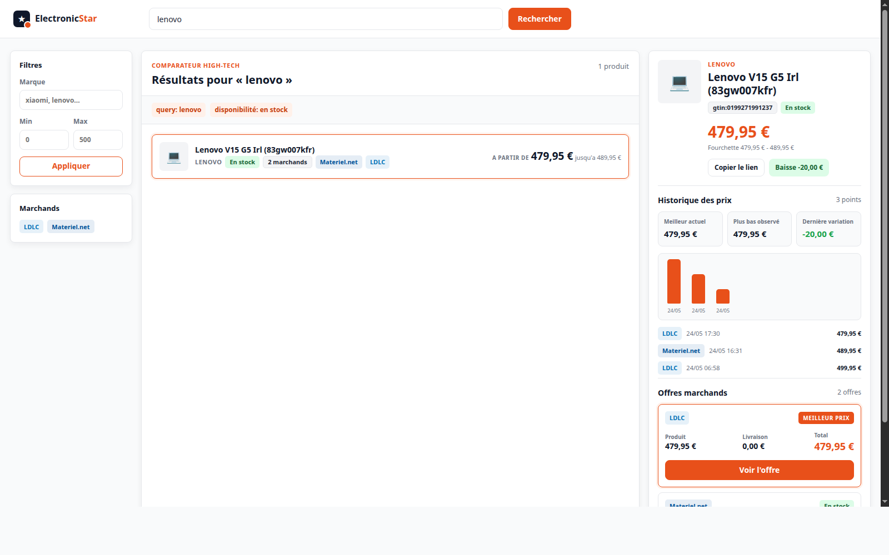

# Electronic-Star

MVP backend/crawler pour un comparateur de prix high-tech.

Le coeur validé du MVP couvre :

- crawl de 2 marchands réels : LDLC et Materiel.net
- normalisation des offres
- matching produit canonique, y compris inter-marchands via GTIN/MPN
- offres courantes par marchand
- historique de prix
- indexation Elasticsearch
- API de recherche et d'offres
- test d'intégration fixture avec vérification `price_min` / `price_max`

## Prérequis

- Docker Compose
- Python 3.12 avec `.venv`

Les commandes ci-dessous utilisent `docker compose`. Si Docker demande les droits root sur ta machine, préfixe simplement avec `sudo`.

## Démarrage

```bash
cp .env.example .env
docker compose up -d
```

Avant d'exposer l'API ailleurs que sur ta machine, remplace `OPS_ADMIN_TOKEN`
dans `.env`. Cette clé protège les routes opérationnelles `/ops`.
Si ton fichier `.env` existe déjà, ajoute simplement cette ligne puis redémarre l'API.

Vérifier les services :

```bash
docker compose ps
```

Appliquer les migrations, seed les marchands et préparer Elasticsearch :

```bash
docker compose exec api alembic upgrade head
docker compose exec api python -m apps.api.scripts.seed
docker compose exec api python -m apps.api.scripts.es_setup
```

## Démo rapide

La démo stable reset Postgres/Elasticsearch, recharge les fixtures LDLC + Materiel.net,
puis ouvre automatiquement le produit comparable Lenovo avec deux marchands et des prix cohérents à 499,95 EUR :

```bash
DOCKER_SUDO=1 make demo-reset-ingest
sudo docker compose restart api
xdg-open http://localhost:8000/ui/demo
```

Si Docker ne demande pas `sudo` sur ta machine :

```bash
make demo-reset-ingest
docker compose restart api
xdg-open http://localhost:8000/ui/demo
```



## Ingestion de démo

LDLC peut être bloqué réseau selon l'IP du container. Pour une démo stable, utiliser les fixtures déjà générées :

```bash
docker compose run --rm crawler python -m apps.crawler.scripts.ingest_json /app/apps/crawler/ldlc_test.json
docker compose run --rm crawler python -m apps.crawler.scripts.ingest_json /app/apps/crawler/materiel_test.json
```

Vérifier les volumes ingérés :

```bash
docker compose exec -T postgres psql -U app -d electronic_star -c "
select 'merchants' table_name, count(*) from merchants
union all select 'products', count(*) from products
union all select 'offers', count(*) from offers
union all select 'price_history', count(*) from price_history
union all select 'match_review_queue', count(*) from match_review_queue;
"
```

## Crawl marchand

Tester Materiel.net sans ingestion DB :

```bash
docker compose run --rm crawler scrapy crawl materiel \
  -s CLOSESPIDER_ITEMCOUNT=5 \
  -s ITEM_PIPELINES='{}' \
  -O /app/apps/crawler/materiel_test.json \
  -L INFO
```

Tester LDLC sans ingestion DB, si le site répond depuis le container :

```bash
docker compose run --rm crawler scrapy crawl ldlc \
  -s CLOSESPIDER_ITEMCOUNT=5 \
  -s ITEM_PIPELINES='{}' \
  -O /app/apps/crawler/ldlc_test.json \
  -L INFO
```

Runner de crawl avec export JSON, sans ingestion DB par défaut :

```bash
make crawl-materiel-demo
make crawl-ldlc-demo
```

Si Docker demande les droits root :

```bash
DOCKER_SUDO=1 make crawl-materiel-demo
DOCKER_SUDO=1 make crawl-ldlc-demo
```

Pour crawler puis alimenter Postgres/Elasticsearch via les pipelines Scrapy :

```bash
DOCKER_SUDO=1 make crawl-materiel-ingest
DOCKER_SUDO=1 make crawl-ldlc-ingest
```

Les runs avec ingestion enregistrent aussi un statut dans Postgres (`crawl_runs`) :
items scrapés, pages OK/KO, début/fin, durée et erreur éventuelle.

Base scheduler périodique, non activée par défaut :

```bash
docker compose run --rm crawler python -m apps.crawler.scripts.scheduler \
  --merchant materiel \
  --interval-minutes 60 \
  --itemcount 20 \
  --ingest
```

Service Docker supervisé pour Materiel.net :

```bash
DOCKER_SUDO=1 make scheduler-materiel-up
DOCKER_SUDO=1 make scheduler-materiel-logs
DOCKER_SUDO=1 make scheduler-materiel-down
```

Service Docker supervisé pour LDLC :

```bash
DOCKER_SUDO=1 make scheduler-ldlc-up
DOCKER_SUDO=1 make scheduler-ldlc-logs
DOCKER_SUDO=1 make scheduler-ldlc-down
```

Lancer/arrêter les deux schedulers :

```bash
DOCKER_SUDO=1 make scheduler-up
DOCKER_SUDO=1 make scheduler-down
```

Les services utilisent le profile Docker `scheduler` et `restart: unless-stopped`.
Paramètres dans `.env` :

```bash
CRAWLER_MATERIEL_INTERVAL_MINUTES=60
CRAWLER_MATERIEL_ITEMCOUNT=20
CRAWLER_MATERIEL_REQUEST_QUEUE=crawler:run_requests:materiel
CRAWLER_LDLC_INTERVAL_MINUTES=60
CRAWLER_LDLC_ITEMCOUNT=20
CRAWLER_LDLC_REQUEST_QUEUE=crawler:run_requests:ldlc
CRAWLER_LOG_LEVEL=INFO
RAW_DOCUMENTS_DIR=/app/apps/crawler/raw_documents
OFFER_STALE_AFTER_HOURS=24
OPS_ADMIN_TOKEN=change-me-local-admin-token
```

Quand un crawl avec ingestion est rattaché à un `crawl_run`, les pages produit
brutes sont sauvegardées sous `RAW_DOCUMENTS_DIR` et référencées dans
Postgres (`raw_documents`) avec URL, statut HTTP, hash SHA-256, taille et chemin
du payload. Cela permet d'auditer un prix affiché en remontant à la réponse
source capturée pendant le crawl.

Les prix courants utilisent la date réelle de crawl comme `last_seen_at`.
Par défaut, l'interface marque une offre comme `Crawl ancien` au-delà de
`OFFER_STALE_AFTER_HOURS`.

## API

Interface web de demo :

```bash
xdg-open http://localhost:8000/ui/
```

Demo produit comparable :

```bash
xdg-open http://localhost:8000/ui/demo
```

Dashboard ops :

```bash
xdg-open http://localhost:8000/ui/ops
```

Page detail produit :

```bash
xdg-open http://localhost:8000/ui/product/<PRODUCT_ID>
```

Derniers statuts de crawl :

```bash
export OPS_ADMIN_TOKEN=change-me-local-admin-token
curl -s -H "X-Admin-Token: $OPS_ADMIN_TOKEN" \
  http://localhost:8000/ops/crawl-runs/latest | python3 -m json.tool
```

Documents bruts d'un run :

```bash
curl -s -H "X-Admin-Token: $OPS_ADMIN_TOKEN" \
  http://localhost:8000/ops/crawl-runs/<CRAWL_RUN_ID>/documents | python3 -m json.tool
```

Dernier document brut rattache a une offre :

```bash
curl -s -H "X-Admin-Token: $OPS_ADMIN_TOKEN" \
  http://localhost:8000/ops/offers/<OFFER_ID>/source-document | python3 -m json.tool
```

Relancer un marchand via le scheduler :

```bash
curl -s -X POST -H "X-Admin-Token: $OPS_ADMIN_TOKEN" \
  http://localhost:8000/ops/crawl-runs/materiel/run | python3 -m json.tool

curl -s -X POST -H "X-Admin-Token: $OPS_ADMIN_TOKEN" \
  http://localhost:8000/ops/crawl-runs/ldlc/run | python3 -m json.tool
```

Dans l'interface web, le bouton de relance demande cette clé admin la première fois,
puis la conserve dans le stockage local du navigateur.

Healthcheck :

```bash
curl -s http://localhost:8000/healthz; echo
```

Recherche produit :

```bash
curl -s "http://localhost:8000/search/products?q=xiaomi&size=5" | python3 -m json.tool
```

Filtrer par marchand :

```bash
curl -s "http://localhost:8000/search/products?q=lenovo&merchant=ldlc&size=5" | python3 -m json.tool
```

Offres d'un produit :

```bash
curl -s "http://localhost:8000/products/<PRODUCT_ID>/offers" | python3 -m json.tool
```

Chaque offre contient un `offer_id`, utilisé par l'interface pour auditer la
source crawl via les routes `/ops`.

Detail complet d'un produit :

```bash
curl -s "http://localhost:8000/products/<PRODUCT_ID>" | python3 -m json.tool
```

Historique de prix :

```bash
curl -s "http://localhost:8000/products/<PRODUCT_ID>/price-history" | python3 -m json.tool
```

Export CSV des offres :

```bash
curl -L -o offers.csv "http://localhost:8000/products/<PRODUCT_ID>/offers.csv"
```

Export CSV de l'historique :

```bash
curl -L -o price-history.csv "http://localhost:8000/products/<PRODUCT_ID>/price-history.csv"
```

Remplacer `<PRODUCT_ID>` par un UUID retourné par la recherche.

## Tests

Installer les dépendances locales :

```bash
.venv/bin/python -m pip install -r requirements/dev.txt
```

Suite rapide non destructive :

```bash
.venv/bin/python -m pytest -q
```

Test d'intégration ingestion :

```bash
RUN_INGEST_INTEGRATION=1 .venv/bin/python -m pytest tests/integration/test_ingest_fixtures.py -q -rs
```

Attention : ce test est destructif. Il reset les tables métier Postgres et recrée l'index Elasticsearch `products-write-v1`.

Ce test vérifie aussi le scénario coeur du comparateur :

- un même Lenovo présent chez LDLC et Materiel.net avec le même GTIN
- un seul produit canonique
- deux offres marchands rattachées au produit
- `price_min = 499.95` et `price_max = 499.95` dans Elasticsearch

## Reset de démo

Une commande remet Postgres/Elasticsearch à zéro et recharge les fixtures LDLC + Materiel.net :

```bash
make demo-reset-ingest
```

Si Docker demande les droits root :

```bash
DOCKER_SUDO=1 make demo-reset-ingest
```

Par défaut, cette commande charge les fixtures d'intégration qui prouvent le matching inter-marchands : Lenovo LDLC + Materiel.net, avec `price_min = 499.95` et `price_max = 499.95`.

Pour montrer volontairement l'historique et les badges de baisse de prix sans polluer la démo stable :

```bash
make demo-price-drop
```

Si Docker demande les droits root :

```bash
DOCKER_SUDO=1 make demo-price-drop
```

Cette variante charge `tests/fixtures/price_drop/ldlc_price_drop.json` après les fixtures normales : LDLC passe alors de `499.95` à `479.95` sur le Lenovo, ce qui crée un scénario de baisse dédié.

Pour recharger les fixtures live plus volumineuses générées par crawl :

```bash
DEMO_FIXTURE_SET=live make demo-reset-ingest
```

Reset Postgres métier :

```bash
docker compose exec -T postgres psql -U app -d electronic_star -c "
truncate table price_history, offers, product_aliases, match_review_queue, products restart identity cascade;
"
```

Reset Elasticsearch :

```bash
docker compose exec -T elasticsearch curl -s -X DELETE http://localhost:9200/products-write-v1
docker compose exec api python -m apps.api.scripts.es_setup
```

Puis relancer l'ingestion de démo.

## Etat MVP

Prêt :

- pipeline crawler vers DB
- pipeline DB vers Elasticsearch
- API recherche
- API offres
- matching canonique inter-marchands validé par fixture GTIN
- agrégation Elasticsearch `price_min` / `price_max` validée
- historique de prix
- 2 marchands réels
- schedulers Materiel.net et LDLC supervisés avec relance manuelle
- dashboard ops web
- documents bruts de crawl rattachés aux runs pour audit des prix
- routes `/ops` protégées par `OPS_ADMIN_TOKEN`

Reste hors MVP coeur :

- review manuelle
- CI
- monitoring
- robustesse anti-blocage production
